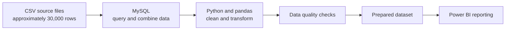

# West Africa Health Data Preparation

## Project overview

This collaborative research project prepared health data for analysis of countries and regions in West Africa experiencing worsening health conditions. The broader research aimed to help identify areas that may need additional outreach.

My contribution focused on querying, combining, cleaning, transforming, and validating the data. I prepared the dataset for downstream reporting in Power BI; I did not produce the final analysis or its conclusions.

## Data overview

The input consisted of several CSV files containing approximately 30,000 rows of health-related data. The data covered:

- Hospital deaths and recorded causes
- Country, state, or regional information
- Medicines available
- Types of hospitals
- Patient economic class
- Access to medical facilities

The files were combined for analysis using MySQL. This portfolio summary describes the workflow; it does not include patient-level data.

## Tools and workflow

- **MySQL:** queried and combined data from the supplied CSV files
- **Python and pandas:** cleaned and transformed the combined data
- **Git and GitHub:** collaborated with others using branches and pull requests
- **Power BI:** used downstream for reporting by the reporting team

## Data preparation

### 1. Querying and combining data

I used MySQL to query and combine information from the CSV files so it could be prepared for analysis across the relevant health and geographic dimensions.

### 2. Handling missing values

Rows affected by missing values were removed during the cleaning process. This reduced incomplete records in the prepared dataset.

### 3. Deduplicating patient records

I used the patient ID as the record key when identifying duplicate records and retained one record per key, following the project’s deduplication rule.

### 4. Standardizing categories

I standardized inconsistent spellings in categorical values so equivalent labels used a consistent spelling. This supported more reliable grouping and comparison across regions and other categories.

### 5. Correcting data types

I converted fields to appropriate data types for analysis. This helped ensure that values were represented consistently when queried, transformed, and prepared for reporting.

## Validation

After cleaning and combining the data, I checked:

- Whether missing values remained
- Whether patient ID keys were still duplicated
- Whether record counts were consistent with the cleaning and combination steps

These checks helped confirm that the prepared data was suitable for handoff to the reporting stage.

## Collaboration

I used Git to collaborate with other contributors. Work was managed through branches and pull requests, allowing changes to be reviewed and incorporated into the shared project.

## Scope and contribution

My work covered data preparation: querying and combining the supplied data, handling missing and duplicate records, standardizing category values, correcting data types, and validating the prepared output.

The cleaned data was prepared for Power BI reporting. My contribution did not include building the final Power BI report or presenting the final research conclusions, so this case study focuses on the preparation workflow rather than claiming health outcome findings.

## Technologies

MySQL · Python · pandas · Git · GitHub · Power BI
