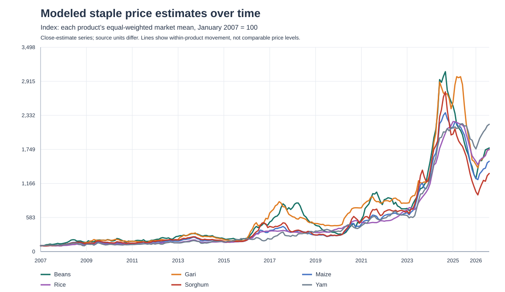

# Nigeria Staple Food Price Trends Across Markets

An end-to-end analysis of modeled staple-food price estimates across Nigerian local markets. The project prepares the World Bank source file with Python and pandas, reshapes it into a market–month–commodity fact table, produces Power BI-ready summaries, and provides MySQL schema and analysis queries.

## Business question

How have modeled staple-food prices changed over time, and how do recent estimates differ across the markets and states represented in the source data?

This is a descriptive monitoring analysis. It does not explain the causes of price changes or claim to represent every Nigerian market or household.

## Source and scope

- **Source:** World Bank Microdata Library, [Monthly food price estimates by product and market — Nigeria](https://microdata.worldbank.org/catalog/4503/index.php/NGA_2021_RTFP_v02_M).
- **Data file:** `NGA_RTFP_mkt_2007_2026-08-24.zip` (CSV inside); save the extracted CSV as `data/raw/NGA_RTFP_mkt_2007_2026-08-24.csv`.
- **Snapshot coverage:** January 2007–August 2026; Nigerian naira (NGN).
- **Core dashboard series:** beans, gari, maize, rice, sorghum, and yam, using the source's `c_` (close estimate) fields.
- **Additional fields retained:** source unit, market location, commodity trust score, and spatial-interpolation flag.

The values are modeled estimates, not observed transaction prices or official CPI. Product source units differ (for example, beans use 2.5 kg while some FAO series use 1 kg), so cross-product price-level comparisons should not be made without a valid unit conversion. The project emphasizes within-product trends and percentage changes. National and state summaries are equal-weighted means over the included market estimates, not population-weighted measures.

### Geography and row handling

The raw file has 17,464 rows and 74 distinct `geo_id` values. Seven IDs are labeled as `Geopolitical Zone`, `National Average`, or `Market Average`; those summary geographies are excluded from the physical-market analysis so that aggregate rows are not counted again alongside their underlying markets. This leaves 67 local-market IDs, 14 normalized state labels, and 15,812 physical market-month rows. The catalog landing page reports 73 markets; that figure does not equal the 67 local-market IDs retained here. The file and catalog may count summary geographies differently, so the discrepancy is recorded instead of silently treating the counts as equivalent.

The source spelling `Kano State (1)` is normalized to `Kano` for grouping; `dim_market.csv` retains the source label in `source_state_label`. Rows are keyed by market ID and date; no duplicates, missing IDs, negative close estimates, or missing close estimates were found in the retained physical-market rows. Quality details are in `reports/data_quality_summary.json`.

## Current snapshot findings

For August 2026 versus August 2025, equal-weighted means of the 67 included market estimates changed as follows:

| Staple series | YoY change | August 2026 mean estimate | Source unit |
|---|---:|---:|---|
| Beans | +1.8% | NGN 2,559.17 | 2.5 kg |
| Yam | +1.1% | NGN 3,259.19 | 2.5 kg |
| Rice (1 kg source unit) | −12.4% | NGN 1,933.01 | 1 kg |
| Maize (1 kg source unit) | −17.0% | NGN 608.44 | 1 kg |
| Sorghum (1 kg source unit) | −17.8% | NGN 443.91 | 1 kg |
| Gari (1 kg source unit) | −19.9% | NGN 684.85 | 1 kg |

These are changes in the published modeled estimates, not evidence of why prices moved, proof of affordability changes, or forecasts. The August snapshot is the latest date in the downloaded version; future dataset releases may revise estimates.

## Repository structure

```text
data/
  raw/                 # source CSV; excluded from version control
  processed/           # generated Power BI and MySQL import CSVs
src/
  prepare_analyze.py   # validation, reshape, summaries, quality checks
db/
  mysql_setup_and_analysis.sql
reports/
  data_quality_summary.json
  excluded_summary_geographies.csv
  latest_month_summary.csv
  latest_state_summary.csv
  staple_price_index.svg
```



The index is set to 100 for each product in January 2007. It supports comparison of the *direction and relative size of change within each series* while avoiding a misleading comparison of products sold in different source units.

## Reproduce the preparation and analysis

1. Download and extract the source ZIP from the linked World Bank record.
2. Place `NGA_RTFP_mkt_2007_2026-08-24.csv` in `data/raw/`.
3. Install Python requirements: `python -m pip install -r requirements.txt`.
4. Run: `python src/prepare_analyze.py`.

The script validates the required fields, filters to Nigeria and physical local markets, checks market-month uniqueness and price quality, converts six close-estimate series from wide columns into tidy rows, and writes outputs to `data/processed/` and `reports/`.

## MySQL

Use MySQL 8 and `db/mysql_setup_and_analysis.sql` to create the database, dimensions, and fact table. Import `dim_market.csv` and `dim_commodity.csv` first, then import `fact_staple_market_month.csv` using MySQL Workbench's Table Data Import Wizard. The SQL file includes example analytical queries for monthly national trends, state rankings, market-level year-over-year movement, and price dispersion. The import files are UTF-8 CSVs with a header row.

The SQL script is provided for reproducibility. It has not been run against a local MySQL account as part of this project package.

## Power BI model and suggested report

Import these generated files:

- `data/processed/fact_staple_market_month.csv` — detailed market/date/commodity records.
- `data/processed/dim_market.csv` — market attributes.
- `data/processed/dim_commodity.csv` — commodity labels and source units.
- `data/processed/agg_national_monthly.csv` and `agg_state_monthly.csv` — pre-aggregated trend tables.

Suggested pages:

1. **National trends:** line chart of mean estimated price by date, commodity slicer, plus YoY movement and market count.
2. **State comparison:** latest state estimates for a selected commodity, with state and date slicers; compare only within the selected commodity and source unit.
3. **Market detail:** market time series and trust/interpolation indicators for drill-through.

For a Power BI model, relate `dim_market[market_id]` to `fact_staple_market_month[market_id]` and `dim_commodity[commodity_code]` to the corresponding fact field. Use the aggregation tables as separate precomputed visuals or measures; do not relate both facts into a many-to-many loop.

## Limitations and responsible use

- Estimates are modeled and can differ from prices observed by households or local agencies.
- Market coverage is limited to the 67 physical market IDs remaining after summary-geography records are removed; this is not a census of Nigerian markets.
- Equal market weighting gives a small market the same contribution as a large market.
- Source units differ across commodities; units are retained in outputs.
- The analysis is descriptive and does not identify price-change causes or provide causal estimates.
- Cite the World Bank record and do not imply World Bank endorsement.

## Attribution

Source: Bo Pieter Johannes Andrée, *Monthly food price estimates by product and market, Nigeria* (dataset version 2026-08-24), World Bank Microdata Library, reference `NGA_2021_RTFP_v02_M`. See the [study record](https://microdata.worldbank.org/index.php/catalog/study/NGA_2021_RTFP_v02_M). This project is an independent analysis and does not imply endorsement by the World Bank.
